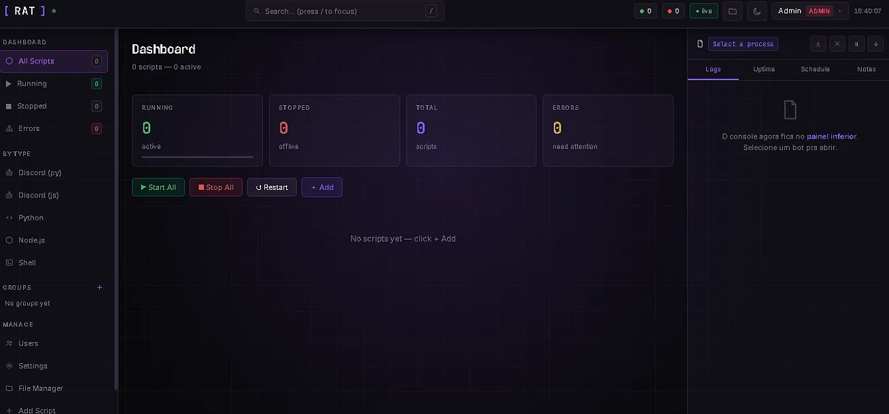
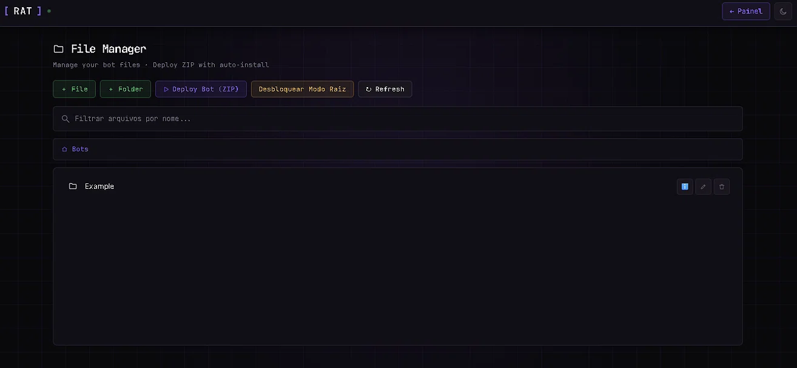

# RatPanel — Gerenciador de Processos para Scripts e Bots

<p align="center">
  
</p>

<p align="center">
  <b>Rode, monitore e reinicie seus bots do Discord e scripts — tudo em um painel web.</b><br>
  Sem SSH, sem PM2, sem dor.
</p>

<p align="center">
  <a href="LICENSE"></a>
  
  
  <a href="https://github.com/ratao21936/RatPanel/stargazers"></a>
</p>

---

## Por que existe

Rodar bots e scripts soltos no terminal é frágil: você não sabe se caiu, não tem logs centralizados, não tem alerta e reinicia tudo na mão. O **RatPanel** resolve isso com um painel web simples — com logs ao vivo, auto-restart inteligente, agendamento e alertas no Discord.

---

## Funcionalidades

- 🖥️ **Dashboard ao vivo** — status dos processos em tempo real, CPU e memória
- 📋 **Logs ao vivo** — visualizador de logs em streaming com pausar, exportar e limpar
- 📊 **Gráficos de uptime** — histórico de uptime por processo, registrado a cada 5 minutos
- ⏰ **Agendador** — jobs de auto-restart / start / stop em intervalos
- 🔔 **Alertas via Webhook do Discord** — notificações em crash, start, stop, restart, ou quando um processo desiste após 5 restarts falhos
- 🔐 **Autenticação multiusuário** — login com JWT e papéis (Admin / Operador / Visualizador)
- 🛡️ **Autenticação em dois fatores** — suporte a 2FA via TOTP
- 📦 **Instalador de dependências** — rode `npm install` ou `pip install -r requirements.txt` direto pela UI, com saída ao vivo
- 📂 **File Manager** — navegue, crie, edite e faça deploy de bots em ZIP direto pelo painel
- ✏️ **Editar scripts** — atualize o caminho, tipo, variáveis de ambiente ou configurações de qualquer script registrado a qualquer momento
- 🏷️ **Tags e Anotações** — rotule e comente processos
- 🔁 **Auto-restart com limite de crashes** — reinicia automaticamente em falha, para após 5 crashes consecutivos e dispara um alerta no Discord

---

## Início Rápido

### 1. Instalar
```bash
cd backend
npm install
```

### 2. Configurar
```bash
cp .env.example .env
# Edite o .env — defina JWT_SECRET com algo aleatório!
```

### 3. Iniciar
```bash
npm start
```

### 4. Abrir no navegador
```
http://localhost:6002/login.html
```

Credenciais padrão: **admin / admin123** — troque isso imediatamente após o primeiro login!

---

## 📸 Screenshots

<p align="center">
  
</p>

<p align="center">
  
</p>

---

## Tipos de Script Suportados

| Tipo | Executado com |
|------|---------------|
| Discord Bot (Python) | `python3 script.py` |
| Discord Bot (Node.js) | `node script.js` |
| Python Script | `python3 script.py` |
| Node.js App | `node script.js` |
| Node.js App (npm start) | `npm start` no diretório de trabalho |
| Shell Script | `bash script.sh` |
| Batch File (Windows) | `cmd.exe /c script.bat` |
| PowerShell Script (Windows) | `powershell.exe -File script.ps1` |

---

## Adicionando Scripts

Clique em **+ Add Script** e preencha:
- **Nome** — um rótulo amigável para o processo
- **Tipo** — selecione entre os tipos suportados acima
- **Caminho do Script** — caminho absoluto, ex.: `C:\bots\mybot\index.js` — ou use o File Manager para navegar
- **Diretório de Trabalho** — padrão é a pasta pai do script (obrigatório para `npm start`)
- **Variáveis de Ambiente** — pares `CHAVE=VALOR` separados por espaço, ex.: `TOKEN=abc DEBUG=true`
- **Auto-Restart** — Sempre / Em Falha / Nunca

> **Dica:** Para `npm start`, aponte o campo Caminho do Script para a pasta que contém o `package.json` — não para um arquivo `.js`.

---

## File Manager & Deploy ZIP

O **File Manager** permite gerenciar os arquivos dos seus bots direto pelo painel:

- 📁 Criar arquivos e pastas
- ✏️ Editar arquivos no navegador
- 🗑️ Remover arquivos e pastas
- 📦 **Deploy Bot (ZIP)** — suba um `.zip` com o bot pronto e o painel extrai e instala automaticamente
- 🔓 **Desbloquear Modo Raiz** — acesse pastas fora do diretório padrão (com cuidado)

---

## Detalhes

<details>
<summary><b>🎛️ Ações de Processo</b></summary>

Cada card de processo tem os seguintes botões de ação:

| Botão | Ação |
|--------|--------|
| ▶ | Iniciar |
| ⏹ | Parar (também cancela qualquer auto-restart pendente) |
| ↺ | Reiniciar |
| 📦 | Instalar dependências (`npm install` ou `pip install -r requirements.txt`) |
| ✏️ | Editar configurações do script |
| 🏷️ | Editar tags |
| 🗑️ | Remover |

</details>

<details>
<summary><b>🔁 Auto-Restart e Proteção contra Crashes</b></summary>

Quando o **Auto-Restart** está definido como *Em Falha* ou *Sempre*, o painel reinicia o processo automaticamente usando backoff exponencial (1s → 2s → 4s → 8s → 16s).

Após **5 crashes consecutivos**, o painel para de tentar e:
- Define o processo em estado de erro
- Registra "Auto-restart limit reached" nos logs
- Dispara um alerta via webhook do Discord (se configurado)

Clicar em **Parar** a qualquer momento cancela imediatamente qualquer timer de restart pendente. Um **Restart** manual zera o contador de crashes.

</details>

<details>
<summary><b>🔔 Alertas via Webhook do Discord</b></summary>

Vá em **Configurações → Alertas via Webhook do Discord** e cole a URL do seu webhook.

Você pode ativar alertas para:
- 💥 Crash / Erro
- ▶️ Start
- ⏹️ Stop
- 🔄 Restart
- 💀 Máximo de restarts atingido (sempre dispara se configurado)

Opcionalmente, adicione um **ID de Cargo** para mencionar um cargo nos alertas. Clique em **Enviar Teste** para verificar se está funcionando.

</details>

<details>
<summary><b>⏰ Agendamento</b></summary>

Selecione um processo → abra a aba **Schedule** no painel direito.

Adicione um job escolhendo uma ação (restart / start / stop) e um intervalo (minutos / horas / dias). Os jobs persistem entre reinicializações do servidor.

</details>

<details>
<summary><b>👥 Papéis</b></summary>

| Papel | Permissões |
|------|-------------|
| **Admin** | Acesso total — usuários, adicionar/deletar/editar scripts, start/stop/restart, configurações |
| **Operador** | Start/stop/restart, adicionar/editar scripts, ver logs, gerenciar agendamentos |
| **Visualizador** | Apenas visualizar processos e logs |

</details>

<details>
<summary><b>🔒 Notas de Segurança</b></summary>

- Altere o `JWT_SECRET` no `.env` antes de expor à internet
- Troque a senha padrão do `admin` imediatamente após o primeiro login
- Ative a **Autenticação em Dois Fatores** nas Configurações para proteção extra
- Tokens expiram após 24 horas
- O endpoint de login tem rate limit (20 tentativas por 15 minutos)

</details>

---

## Estrutura de Arquivos

```
RatPanel/
├── backend/
│   ├── server.js           # Servidor Express + WebSocket
│   ├── processManager.js   # Spawn/stop/restart/log/stats + instalar deps
│   ├── webhookManager.js   # Alertas via webhook do Discord
│   ├── authManager.js      # Auth JWT, bcrypt, 2FA, papéis
│   ├── scheduler.js        # Jobs agendados
│   ├── configStore.js      # Persistência em processes.json
│   ├── processes.json      # Seus scripts registrados (auto-criado)
│   ├── users.json          # Contas de usuário (auto-criado)
│   ├── schedules.json      # Jobs agendados (auto-criado)
│   ├── webhook.json        # Config do webhook (auto-criado)
│   ├── .env.example
│   └── package.json
└── frontend/
    ├── index.html          # Dashboard principal
    └── login.html          # Página de login
```

---

## Contribuindo

Contribuições são bem-vindas! Abra uma [issue](https://github.com/ratao21936/RatPanel/issues) ou envie um [pull request](https://github.com/ratao21936/RatPanel/pulls).

## Licença

[MIT](LICENSE)

---

<p align="center">
  <b>Gostou do projeto? Deixe uma ⭐ no repositório — ajuda demais!</b>
</p>
